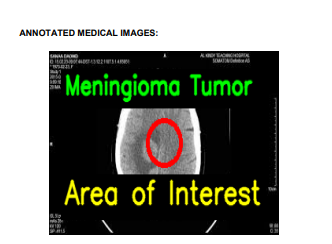
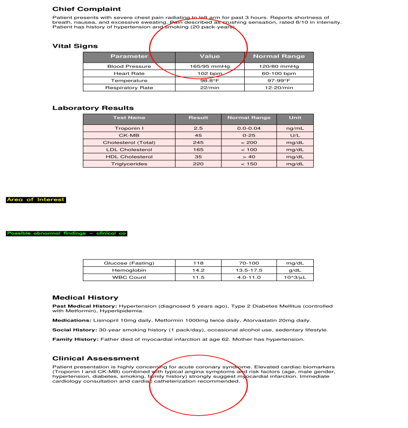

# 🏥 MediCascade AI: Universal Medical Diagnosis Engine
> **"From Black-Box to Glass-Box"** — A multi-agent framework for interpretable, evidence-based medical diagnosis.


## 💡 The Problem
Modern AI in healthcare suffers from the **"Black Box" problem**. Models give a prediction (e.g., "Tumor Detected") but fail to explain *why* or *where*. Doctors cannot trust a number without evidence. Furthermore, single models struggle to correlate multimodal data (text symptoms + visual scans + lab values).

## 🚀 The Solution: MediCascade Architecture
**MediCascade** is a novel **4-Layer Cascade System** that mimics a real-world hospital workflow. Instead of one giant model, we use a team of specialized AI agents that "consult" with each other.


### 🔬 Detailed Layer Breakdown

#### **Layer 0: Multimodal Ingestion**
- **Smart PDF Extraction**: intelligently distinguishes between text-heavy reports and embedded scanned images (e.g., X-Rays pasted in PDFs).
- **Scan Enhancement**: Applies CLAHE (Contrast Limited Adaptive Histogram Equalization) to reveal hidden details in medical scans.

#### **Layer 1: Specialist Agents (The "Doctors")**
We use a suite of industry-standard models, each fine-tuned for a specific domain:
*   **Symptom Analyzer** (`ClinicalBERT`): Maps natural language complaints to standardized medical ontology.
*   **Lab Analyzer** (`BioBERT`): Interprets blood work (CBC, metabolic panels) and flags values outside reference ranges.
*   **Scan Analyzer** (`TensorFlow Keras CNN`):
    *   **Model**: Custom trained CNN on Brain MRI datasets (91% Accuracy).
    *   **Function**: Detects tumors and anomalies in image data.
*   **Notes Analyzer** (`FLAN-T5`): Extracts clinical entities from unstructured doctor's notes.

#### **Layer 2: The Validation Council**
*   **Consensus Voting**: Aggregates opinions from all agents. If the Symptom Agent says "Flu" but the Scan Agent says "Tumor", Layer 2 resolves the conflict based on confidence scores.
*   **Anomaly Detection**: Flags impossible combinations (e.g., "Male patient" + "Pregnancy positive").

#### **Layer 3: Explainable AI (XAI) & Reporting**
This is where we solve the "Black Box" problem.
1.  **Visual XAI (Red Circles)**: We don't just say "Tumor found". We draw **Red Circles** around the exact pixels trigger the detection, and strictly mark **Critical Values** (BP, Heart Rate) in the report.
2.  **Chain-of-Thought Reasoning**: Uses Generative AI (Llama 3 / Gemini) to write a human-readable explanation: *"We diagnosed X because Finding A + Finding B matches the clinical criteria."*

---

## 🛠️ Technology Stack

| Component | Tech Choices |
| :--- | :--- |
| **Backend** | Python 3.12, FastAPI, Uvicorn |
| **Frontend** | React, Vite, TailwindCSS |
| **ML/Deep Learning** | TensorFlow, Keras, PyTorch, OpenCV |
| **NLP Models** | ClinicalBERT, BioBERT, FLAN-T5 |
| **GenAI / LLM** | Ollama (Llama 3 Local), Google Gemini 1.5 Flash |
| **Computer Vision** | OpenCV (Hough Transforms, Canny Edge Detection) |
| **PDF Processing** | ReportLab, PyPDF2, PDFPlumber |

---

## 📸 Screenshots & Demos

### 1. The Dashboard


### 2. Visual XAI: Tumor Detection
The system automatically highlights the tumor region with a **Red Circle** and provides an ML Confidence Score.


### 3. System Architecture


---

## 🚀 Getting Started

### Prerequisites
*   Node.js & npm
*   Python 3.10+
*   Ollama (running `llama3`)

### Installation

1.  **Clone the repository**
    ```bash
    git clone https://github.com/your-username/medicascade-ai.git
    cd medicascade-ai
    ```

2.  **Backend Setup**
    ```bash
    cd backend
    python -m venv venv
    source venv/bin/activate
    pip install -r requirements.txt
    ```

3.  **Frontend Setup**
    ```bash
    cd frontend
    npm install
    ```

### Running the App

1.  **Start Backend**:
    ```bash
    cd backend
    ./venv/bin/uvicorn main:app --reload
    ```

2.  **Start Frontend**:
    ```bash
    cd frontend
    npm run dev
    ```

3.  Open `http://localhost:5173` and upload a patient file!

---

## ⚖️ Disclaimer
*This project is a research prototype designed for the Universal AI Disease Prediction Hackathon. It is NOT a certified medical device and should not be used for actual clinical diagnosis.*

# First, kill any existing process on port 8000
kill -9 $(lsof -t -i:8000)

# Then, run the backend from the /backend directory
cd backend && ./venv/bin/uvicorn main:app --reload
