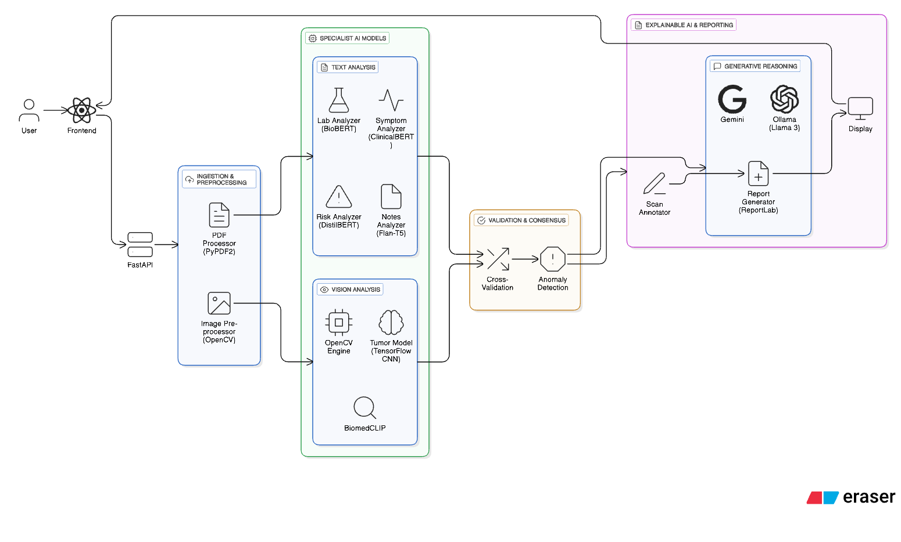

# MediCascade


A four-layer pipeline that turns an unstructured patient PDF into an explainable,
evidence-linked clinical summary. Every conclusion traces back to a source page
and to real published evidence — a glass box, not a black box.

> Research and educational prototype. Not a medical device.



## Highlights

- **Multi-stage AI pipeline** — six specialist agents run in parallel, then a
  validation layer classifies each finding as supported / uncertain / contradicted.
- **Evidence-grounded** — claims are backed by live PubMed abstracts and FDA
  drug-safety records, not invented citations.
- **Full provenance** — Layer 0 extraction is deterministic and maps every fact
  to the page it came from, so output is auditable.
- **Production hygiene** — typed Pydantic models, pytest suite, Ruff linting, and
  GitHub Actions CI on every push.

## Architecture

Four sequential layers. Layer 0 is deterministic; later layers use language
models constrained by the structured facts and external evidence passed forward.

| Layer | Role |
|-------|------|
| **0 — Intake** | Extract text/tables/images from the PDF, classify sections, build a provenance map. No AI. |
| **1 — Specialists** | Parallel agents (notes, labs, medication, history, exposure, risk) propose diagnoses, red flags and risk factors. |
| **2 — Validator** | Classify findings and attach real evidence from PubMed and OpenFDA. |
| **3 — Reporting** | Generate the doctor-facing PDF: explainable narrative, evidence links, ICD-10 coding, critical-value highlights. |

## Tech stack

- **Backend** — Python, FastAPI, Pydantic, SQLite
- **Frontend** — React, Vite, Tailwind CSS
- **Document/NLP** — pdfplumber, Tesseract OCR, spaCy
- **AI** — LLM specialists via Groq; PubMed eUtils + OpenFDA for evidence;
  optional PyTorch 3D U-Net for brain-MRI segmentation

## Run it

```bash
# System packages (Debian/Ubuntu)
sudo apt-get install -y tesseract-ocr poppler-utils

# Backend
cd backend
python -m venv venv && source venv/bin/activate
pip install -r requirements.txt
python -m spacy download en_core_web_sm
cp .env.example .env          # add GROQ_API_KEY (+ OPENROUTER_API_KEY)
uvicorn main:app --reload --port 8000

# Frontend (separate terminal)
cd frontend
npm install && npm run dev    # http://localhost:5173
```

## Tests & CI

```bash
cd backend
pip install -r requirements-dev.txt
ruff check ..    # lint
pytest           # unit + smoke tests
```

Unit tests run with no API keys; pipeline smoke tests skip when heavy
dependencies are absent. Both backend (lint + test) and frontend (build) lanes
run on every push — see [`.github/workflows/ci.yml`](.github/workflows/ci.yml).

## Limitations

The ICD-10 lookup covers common diagnoses, confidence scores are model-reported
rather than clinically calibrated, and the FHIR export is not schema-validated.
